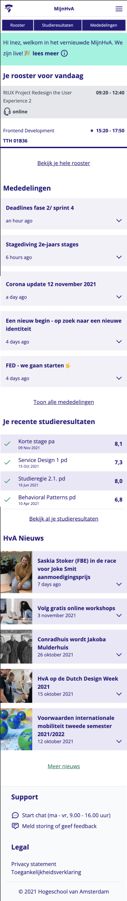
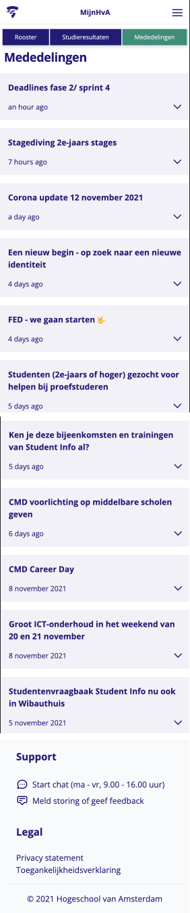
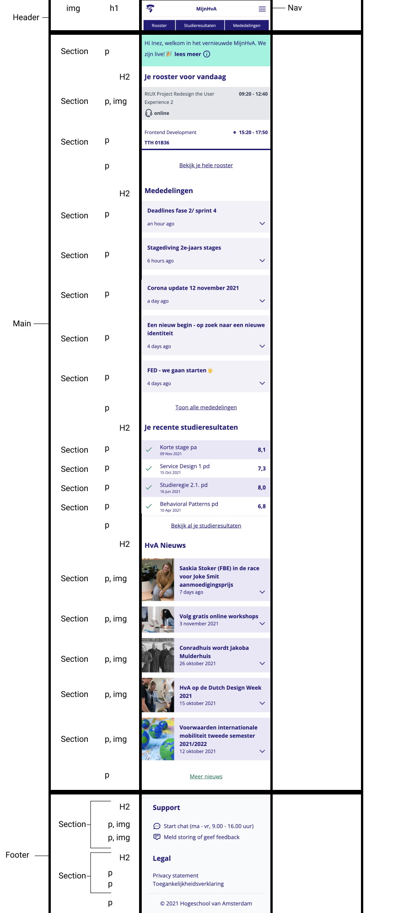

# Procesverslag
Markdown is een simpele manier om HTML te schrijven.  
Markdown cheat cheet: [Hulp bij het schrijven van Markdown](https://github.com/adam-p/markdown-here/wiki/Markdown-Cheatsheet).

Nb. De standaardstructuur en de spartaanse opmaak van de README.md zijn helemaal prima. Het gaat om de inhoud van je procesverslag. Besteedt de tijd voor pracht en praal aan je website.

Nb. Door *open* toe te voegen aan een *details* element kun je deze standaard open zetten. Fijn om dat steeds voor de relevante stuk(ken) te doen.

## Jij

uitwerken voor kick-off werkgroep

### Auteur:
Inez Anema

#### Je startniveau:
Blauw (of het laagste niveau mogelijk)

#### Je focus:
Responsive
 

## Je website

uitwerken voor kick-off werkgroep

### Je opdracht:
https://student.mijnhva.nl/landing

#### Screenshot(s) van de eerste pagina (small screen): 
hier de naam van de pagina  

#### Screenshot(s) van de tweede pagina (small screen):
hier de naam van de pagina  

 

## Breakdownschets (week 1)

uitwerken na afloop 2e werkgroep

### de hele pagina: 

### dynamisch deel (bijv menu): 

### wellicht nog een dynamisch deel (bijv filter): 

## Voortgang 1 (week 2)

Ik heb van de pagina's de html geprobeert af te hebben. Ik heb door de week heen weinig tijd i.v.m het project en heb nog niet veel tijd kunnen besteden aan front end. Begonnen met structuur van de HTML pagina als voorbereiden voor de CSS

### Stand van zaken
De basics van HTML ging wel goed. Alleen soms erg stoeien met article and section. CSS gaat wel erg moeilijk worden, want daar ben ik niet goed in.

### Verslag van meeting
hier na afloop snel de uitkomsten van de meeting vastleggen

- HTML is goed, paar dingen aanpassen. (nav, ul, li)
- Echt een begin maken met de CSS (img stijlen, nav stijlen, flexbox op de: nav, table, focus state op nav)

## Voortgang 2 (week 3)

Standaard kleuren van de website zijn toegepast en verder gewerkt aan de HTML, nog weinig CSS

### Stand van zaken
Het uitwerken van een nav is lastig, vooral omdat er twee nav's zijn. Had een aantal vragen over kleur (#, rgba, naam). Verder gegaan met de HTML van de index, nog niet van de detail.

### Verslag van meeting
HTML is goed en semantisch correct, ik kan 2 nav's gebruiken en div's op bepaalde punten als er geen beter alternatief is. Ga verder met CSS!!

## Toegankelijkheidstest (week 4)

Op dit punt nog weinig gedaan met toegankelijkheid, dus mijn website kwam niet door de test heen. Kon moeilijk tabben en je zag niet wat je had aangeklikt. Doordat ik weinig verschillende kleuren gebruikt en ook tekens (check bij studieresultaten, iconen bij rooster) was het voor kleurenblind niet een groot probleem.

### Bevindingen
Lijst met je bevindingen die in de test naar voren kwamen:
1. moeilijk op te tabben door de website (focus state)
2. niet overal alt text op afbeeldingen

#### Eerste bevinding states
Doordat ik nog geen focus state heb gaat tabben moeilijk. Nu moet je nog veel scrollen door de website, dus het is niet toegankelijk voor mensen die met toetsenbord moeten navigeren.

Voeg focus state toe

#### Tweede bevinding alt text
Ik had nog niet bij elke afbeelding een alt text toegevoegd. Dit maakte mijn website minder toegankelijk voor mensen die een screenreader gebruiken.

Hier een omschrijving van hoe het opgelost kan worden (met indien nodig een afbeelding)

## Voortgang (week 5)

Table styling gefixt, detail pagina gemaakt, eerste versie medelingen gemaakt

### Stand van zaken
Het uitwerken van de table ging best goed toen ik eenmal door had hoe het welke met de selectoren. De table zorgde ervoor dat ik minder hoefde te stoeien met de styling en zorgen dat alles achter elkaar stond. 

### Verslag van meeting
HTML is goed en semantisch correct, ik kan 2 nav's gebruiken en div's op bepaalde punten als er geen beter alternatief is. Ga verder met CSS!!

## Voortgang 2 (week 6) Les voor de vakantie

Ik ben niet naar de les gegaan

### Stand van zaken
Het uitwerken van een nav is lastig, vooral omdat er twee nav's zijn. Had een aantal vragen over kleur (#, rgba, naam). Verder gegaan met de HTML van de index, nog niet van de detail.

### Verslag van meeting
HTML is goed en semantisch correct, ik kan 2 nav's gebruiken en div's op bepaalde punten als er geen beter alternatief is. Ga verder met CSS!!

## Voortgang 2 (week 7)

uitwerken voor 3e voortgang

### Stand van zaken
hier dit ging goed & dit was lastig (neem ook screenshots op van delen van je website en code)

### Agenda voor meeting
samen met je groepje opstellen

| student 1      | student 2          | student 3    | student 4        |
| ---            | ---                | ---          | ---              |
| dit bespreken  | en dit             | en ik dit    | en dan ik dat    |
| en dat ook nog | dit als er tijd is | nog een punt | dit wil ik zeker |
| ...            | ...                | ...          | ...              |

### Verslag van meeting
hier na afloop snel de uitkomsten van de meeting vastleggen

- punt 1
- punt 2
- nog een punt
- ...

## Voortgang 3 (week 4)

uitwerken voor 3e voortgang

### Stand van zaken
hier dit ging goed & dit was lastig (neem ook screenshots op van delen van je website en code)

### Agenda voor meeting
samen met je groepje opstellen

| student 1      | student 2          | student 3    | student 4        |
| ---            | ---                | ---          | ---              |
| dit bespreken  | en dit             | en ik dit    | en dan ik dat    |
| en dat ook nog | dit als er tijd is | nog een punt | dit wil ik zeker |
| ...            | ...                | ...          | ...              |

### Verslag van meeting
hier na afloop snel de uitkomsten van de meeting vastleggen

- punt 1
- punt 2
- nog een punt
- ...

## Voortgang 3 (week 4)

uitwerken voor 3e voortgang

### Stand van zaken
hier dit ging goed & dit was lastig (neem ook screenshots op van delen van je website en code)

### Agenda voor meeting
samen met je groepje opstellen

| student 1      | student 2          | student 3    | student 4        |
| ---            | ---                | ---          | ---              |
| dit bespreken  | en dit             | en ik dit    | en dan ik dat    |
| en dat ook nog | dit als er tijd is | nog een punt | dit wil ik zeker |
| ...            | ...                | ...          | ...              |

### Verslag van meeting
hier na afloop snel de uitkomsten van de meeting vastleggen

- punt 1
- punt 2
- nog een punt
- ...

## Eindgesprek (week 5)

uitwerken voor eindgesprek

### Stand van zaken
hier dit ging goed & dit was lastig (neem ook screenshots op van delen van je website en code)

### Screenshot(s)

hier screenshot(s) van je eindresultaat

## Bronnenlijst

continu bijhouden terwijl je werkt

Nb. Wees specifiek ('css-tricks' als bron is bijv. niet specifiek genoeg).

1. https://developer.mozilla.org/en-US/docs/Web/CSS/object-fit?retiredLocale=nl
2. https://www.w3schools.com/html/html_id.asp
3. https://www.w3schools.com/html/html_tables.asp
4. https://www.w3schools.com/howto/howto_js_toggle_dark_mode.asp
5. https://www.w3schools.com/howto/howto_css_sticky_element.asp
6. https://codepen.io/shooft/pen/zYzdMwO
7. https://codepen.io/joostf/pen/MOxQex

